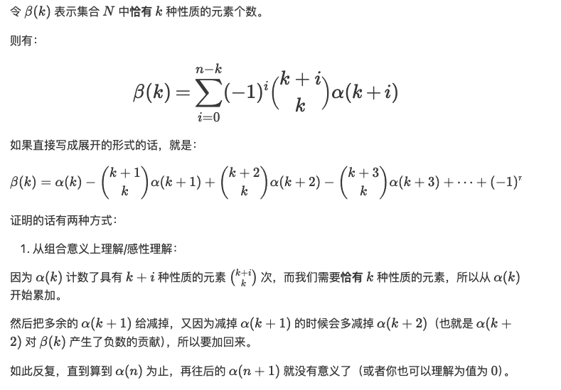

## ABC243

### A

Tag：模拟

循环模拟即可

### B

Tag：模拟

模拟，左边的人满足条件往右走，右边的人往左走。计数统计一下

### C

Tag：模拟

将所有的门锁上，需要将左边的门锁上，再走到右边锁上右边的门。

抽象成在一个区间L，R内，所有的0变成1，操作数为1；所有的1先变成0再变成1，操作数为2。

L和R的位置就是最左边和最右边0所在的位置。然后统计LR区间内0和1的数量即可。

若出发点pos在LR中间，则直接统计01数量算出答案。

若当前出发点pos在L的左侧，则L应该修改为pos+1；若pos在R右侧，则R应该为pos。

### D

Tag：模拟，优先队列

用两个优先队列分别维护排队进入饭店时间和离开饭店的时间。

每一次循环，只处理一个事情，要么处理排队队列，要么处理离开队列，谁先触发事件就先处理谁。

如果排队队列队头事件事件比离开队列队头事件早，且饭店可以容纳队头人数，则处理排队队列。否则处理离开队列。

处理队列的时候需要维护当前时间和饭店人数。

### E

Tag：前缀和

对于每一询问L，R，分别计算LR区间内每一个数字的加了多少次，推理出形如$\sum a_i \times cnt_i $的算式。

拆开算式可以发现，每一个$a_i$会以自身为起点向右求和，也会被左边的数字当作起点求和。

以$a_i$自身为起点向右求和的次数为$R-i+1$

被左边的数字求和的次数为$\sum_{j=L}^{i-1} R-j+1-(i-j)$，其中R-j+1为$a_j$为起点的时候向右求和的次数，减去i-j是因为有一部分无法涉及到$a_i$,不能用于计算$cnt_i$。

$$
\begin{align}
&\sum_{j=L}^{i-1} R-j+1-(i-j) \\
= &\sum_{j=L}^{i-1} R-i+1 \\
= &(i-1-L+1)(R-i+1) \\
= &(i-L)(R-i+1)
\end{align}
$$

所以

$$
\begin{align}
cnt_i &= (R-i+1) + (i-L)(R-i+1) \\
&= (i-L+1)(R-i+1)
\end{align}
$$

则

$$
\begin{align}
&\sum_{i = L_i}^{R_i} \Bigl[ a_i \times (R_i - i + 1) \times (i - L_i + 1) \Bigr] \\
= &\sum_i a_i \times \Bigl( -i^2 + (R_i + L_i)i - (L_i - 1)(R_i + 1) \Bigr) \\
= &-\sum_i i^2 a_i + (R_i + L_i) \times \sum ia_i 
   - (L_i - 1)(R_i + 1) \sum a_i
\end{align}
$$

可以发现$i^2a_i, ia_i, a_i$的求和可以用前缀和预处理求解。

### F

Tag: 广义容斥定理（**[广义容斥定理教程](https://www.luogu.com/article/xx9q9w4w)**），gcd/lcm

简单来说就是：恰好满足K的数量 = 至少满足k - 至少满足K+1 + 至少满足K+2 - 至少满足K+3 ……

代入式子即可

### G
